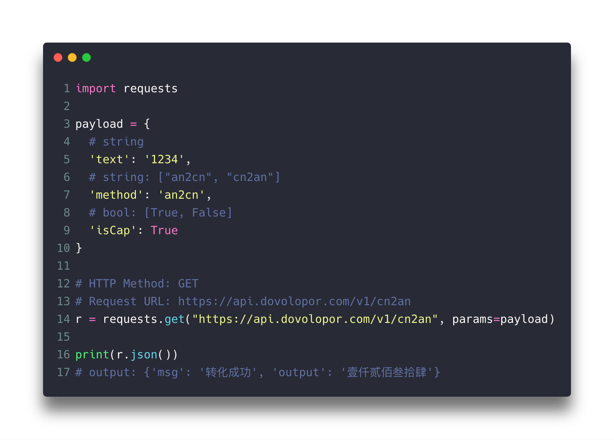
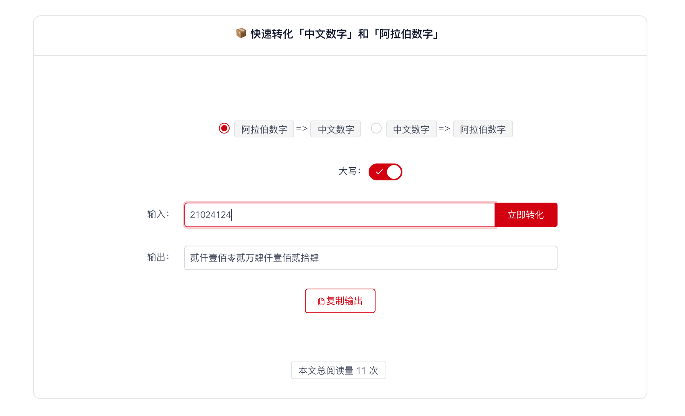

# 📦 cn2an: Chinese Numerals To Arabic Numerals

`cn2an` 是一个将「中文数字」和「阿拉伯数字」互相转化的工具包。

[](https://travis-ci.org/HaveTwoBrush/cn2an)
[](https://docs.python.org/3.6/)
[](https://pypi.org/project/cn2an/)
[](./LICENSE)

> **🚨更新日志：**
>
> - `v0.0.7` 修复 一千五百万零三百零一 等类似格式无法正确转化的问题。
> - `v0.1.0` 重构代码，兼容 Python 2.7。
> - `v0.1.3` 修复一些编码问题，放弃支持 Python 2.7。
> - `v0.2.0` 修复静态文件的相对路径问题。
> - `v0.2.1` 更新 an2cn 11. => 十一；加入 an2cn 输入数据过长的异常处理。
> - `v0.2.2` 修复 an2cn 007 => 七。
> - `v0.2.3` 修复命令行模式与程序调用模式参数互相干扰导致的错误。
> - `v0.3.0` 添加转化 阿拉伯数字 => 人民币大写 功能。

## 1 功能

1. 支持 `中文数字` => `阿拉伯数字`；
2. 支持 `中文数字大写` => `阿拉伯数字`；
3. 支持 `阿拉伯数字` => `中文数字`；
4. 支持 `阿拉伯数字` => `中文数字大写`；
5. 支持 `阿拉伯数字` => `人民币大写`； 
6. 支持 `代码` 调用；
7. 支持 `命令行` 调用；
8. 支持[`API`](https://www.dovolopor.com/api) 调用；



9. 支持 [`网页`](https://www.dovolopor.com/cn2an) 使用。


🔗[点我访问](https://www.dovolopor.com/cn2an)

## 2 安装

### 2.1 使用 pip 安装

```shell
pip install cn2an
```

### 2.2 从代码库安装

```shell
git clone https://github.com/HaveTwoBrush/cn2an.git
cd cn2an
Python setup.py install
```

## 3 使用

### 3.1 代码调用

```python
# 在文件首部引入包
import cn2an

# 查看版本
cn2an.__version__
# output: 0.3.0
```

#### 1 `中文数字` => `阿拉伯数字`

```python
cn2an.cn2an("一百万零五十四")
# output: 1000054

# 支持中文数字大写
cn2an.cn2an("壹佰万零伍十肆")
# output: 1000054
```

#### 2 `阿拉伯数字` => `中文数字`

```python
# 支持数字和字符串两种不同类型的输入
cn2an.an2cn("21024124")
cn2an.an2cn(21024124)
# output: 二千一百零二万四千一百二十四

# 支持小数
cn2an.an2cn("0.414")
cn2an.an2cn(0.414)
# output: 零点四一四

# 支持转化成中文数字大写
cn2an.an2cn("21024124", "up")
cn2an.an2cn(21024124, "up")
# output: 贰仟壹佰零贰万肆仟壹佰贰拾肆

cn2an.an2cn("0.414", "up")
cn2an.an2cn(0.414, "up")
# output: 零点肆壹肆

# 支持转化成人民币大写
cn2an.an2cn("21024124", "rmb")
cn2an.an2cn(21024124, "rmb")
# output: 贰仟壹佰零贰万肆仟壹佰贰拾肆元整

cn2an.an2cn("0.414", "rmb")
cn2an.an2cn(0.414, "rmb")
# output: 肆角壹分
```

### 3.2 命令行调用

#### 1 `中文数字` => `阿拉伯数字`

```bash
cn2an 一百万零五十四
# output: 1000054

# 支持小数
cn2an 零点四一四
# output: 0.414

# 支持大写
cn2an 壹佰万零伍拾肆
# output: 1000054
```

#### 2 `阿拉伯数字` => `中文数字`

```bash
an2cn 21024124
# output: 二千一百零二万四千一百二十四

# 支持小数
an2cn 0.414
# output: 零点四一四

# 支持转化成中文数字大写 
an2cn 1000054 up 
# output: 壹佰万零伍十肆
an2cn 0.414 up
# output: 零点肆壹肆

# 支持转化成人民币大写
an2cn 21024124 rmb
# output: 贰仟壹佰零贰万肆仟壹佰贰拾肆元整

an2cn 0.414, rmb
# output: 肆角壹分
```

## 4 版本支持

- 理论上支持 `Windows`、`MacOS`、`Ubuntu` 下的所有 `Python 3.6` 的版本。
- 实际上仅在 `Windows 10`、`MacOS 10.14`、`Ubuntu 16.04` 的 `Python 3.6.3` 上做过完整测试。
- 欢迎提交其他版本使用情况到 [Issues](https://github.com/HaveTwoBrush/cn2an/issues) 中，期待你的反馈。
- 如果你有 `Python 2` 的使用需求，可 Fork 代码自行修改。当然也欢迎提 PR，贡献自己代码给其他人。

## 5 问题反馈

1. 先搜索 [Issues](https://github.com/HaveTwoBrush/cn2an/issues) 中有没有人已经问过类似的问题；
2. 如果没有找到解答，请新开一个 issue；
3. 在「issue 标题」中填写你遇到的问题的简介；
4. 在「issue 详情」中填写你遇到的问题的详情；
5. 最后，不要忘记注明你使用的操作系统（比如 Windows 10）和 Python 版本（比如 Python 3.6.3）。

## 6 计划事项

- [x] 阿拉伯数字转大写中文数字；
- [x] 解决关于零的 bug；
- [x] 支持 幺 => 1 的转化；
- [x] 支持 Windows 10；
- [x] 自动化单元测试；
- [x] 支持在网页上使用；
- [ ] 支持人民币大写转化；
- [ ] auto 模式，自动尝试对数据进行转化，不对数据进行严格校验。

## 7 协议

[MIT License](https://github.com/HaveTwoBrush/cn2an/blob/master/LICENSE)

## 8 交流

欢迎添加微信号：`kinggreenhall`，备注「cn2an」，我邀请你进入交流群。

## 9 致谢

- [Thunder Bouble](https://github.com/sfyc23): 提出很多有效的反馈，包括一些 bug 和新功能。

## 10 参考

- [如何发布自己的包到 pypi ？](https://www.v2ai.cn/python/2018/07/30/PY-1.html)
- [python 中的小陷阱](https://www.v2ai.cn/python/2019/01/01/PY-6.html)